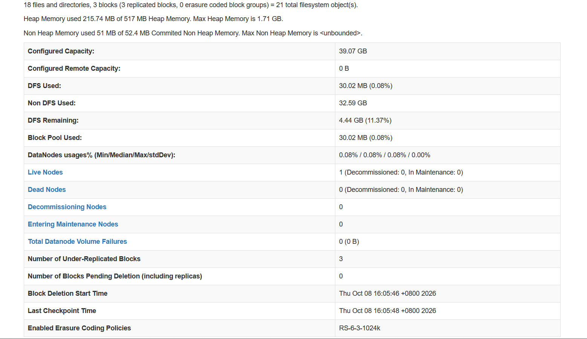

# Hadoop 伪分布式搭建记录

## 环境
- 系统：Ubuntu 24.04.4 LTS（VMware 虚拟机，8GB 内存）
- Hadoop：3.2.4（目录 `/usr/local/hadoop`）
- JDK：1.8.0_504
- 主机名：ubun，HDFS 地址 `hdfs://ubun:9000`
- IP：192.168.132.129

## 启动结果
执行 `start-dfs.sh` + `start-yarn.sh` 后，jps 显示 5 个进程：
- NameNode、DataNode、SecondaryNameNode
- ResourceManager、NodeManager

## WebUI 截图

## 踩过的坑
1. 磁盘只剩 3.3G（92%），清理 conda 缓存、snap 旧版本、apt 缓存后释放到 4.5G
2. WordCount 的 jar 包版本是 **3.2.4**，不是 3.3.6（按自己实际版本改路径）
3. `WARN NativeCodeLoader` 是无害提示，不影响功能
